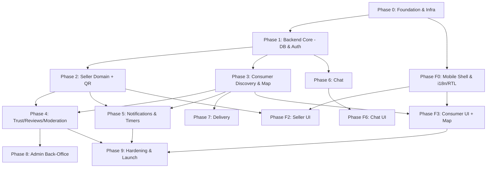

# BUILD_PROMPT.md — Master Build Specification & Agent Instructions

> **Working project name:** `localmarket` (placeholder — rename freely).
> **Purpose of this file:** A single, complete, unambiguous specification handed to AI coding agents to build the entire application. It is organized into **PHASES** and **parallelizable TASKS** so that a large number of agents can build concurrently without conflicts or dropped requirements.
> **Golden rule for every agent:** Do **not** invent, remove, or "improve away" any requirement in this document. If something is ambiguous, stop and ask; do not guess. Follow the file/folder structure and coding standards exactly.

---

## 0. HOW AGENTS SHOULD USE THIS DOCUMENT

1. Read this **entire** file before writing any code.
2. Locate your assigned **Phase** and **Task** in Section 15.
3. Confirm all **dependency tasks** are marked ✅ Done before starting (see the dependency graph in Section 15).
4. Build only your task's scope. Respect module boundaries (Section 13).
5. Meet every item in your task's **Acceptance Criteria** and the global **Definition of Done** (Section 16).
6. Update `PROJECT_MAP.md` for any file you add or move (Section 16).
7. Never hardcode secrets. Never place third-party API keys in the mobile app. Enforce the Security Checklist (Section 12) on every task.

---

## 1. MISSION & PRODUCT OVERVIEW

A cross-platform mobile marketplace (**iOS + Android**) for **Syria** that connects local **shops** and **factories** (sellers) with **consumers** (buyers).

The app is a **DISCOVERY + CONNECTION platform only**. Its core purpose: let shops/factories list products that are **near expiry** at **heavy discounts (up to ~50%)** to avoid waste, and let consumers **discover nearby deals** they would otherwise never hear about — helping people of all income levels access affordable goods.

### 1.1 THE SINGLE MOST IMPORTANT CONSTRAINT — NO IN-APP PAYMENT
- There is **NO in-app payment, wallet, card processing, or money movement of any kind**. Do **NOT** build or scaffold any payment feature.
- All transactions happen **offline**: cash in person, or cash-on-delivery arranged between buyer and seller via in-app chat or phone.
- This keeps the platform out of PCI-DSS scope and out of Syria's sanctioned banking rails. Do not reintroduce payments under any framing.

---

## 2. NON-NEGOTIABLE PRINCIPLES

1. **No payment anywhere in the product.** (See 1.1.)
2. **Bilingual, RTL-first.** Full Arabic (RTL) + English (LTR), user-switchable, correct RTL layout — not just translated strings.
3. **Trust via manual moderation, not automation.** No automatic bans. Complaints go to a human admin who reviews and follows up.
4. **Liability boundary — "No confirmation = no proof = no claim."** A transaction record exists **only** when the seller confirms a QR scan (Section 6.4). If parties skip it, the platform holds no record and no party can demand proof.
5. **Food safety is a hard rule.** Items past the **"use by"** (safety) date are **prohibited** from listing. Items past **"best before"** (quality only) may be listed/discounted. Enforce in validation.
6. **Multi-tenant isolation is mandatory.** A seller must **never** access another seller's data. Object-level authorization on every endpoint.
7. **Keys and secrets never ship in the mobile binary.** All third-party calls (maps, future AI) are proxied through the backend.
8. **Offline resilience.** Syrian internet is unreliable; cache listings locally and degrade gracefully.
9. **Scalable but lean.** Start small (scale-to-zero where possible), grow without rearchitecting.

---

## 3. USERS & ROLES

### 3.1 Seller (Shop OR Factory)
- Account **type** is either `shop` or `factory` (distinct, filterable).
- **Verification:** email **OR** WhatsApp. **Phone number is mandatory** on every seller account.
- **Profile fields:** display name; phone (mandatory); shop/business type/category (e.g., groceries, butcher, bakery, dairy, produce, general — extensible taxonomy); shop photo (optional); personal photo; **location set by dropping a pin on Google Maps** (see 7.2); free-text location description; optional **exterior photos** of the premises.
- Capabilities: create/manage listings, generate/display product QR, receive & confirm QR scans, set quantities, manually edit stock, receive complaints/notifications, chat with consumers, manage delivery offers.

### 3.2 Consumer
- **Verification:** email **OR** WhatsApp. **Phone number is mandatory.**
- Capabilities: search & filter listings, view listing details, see sellers on the map, get directions, **call the seller by phone**, scan a seller's product QR when physically present, chat with sellers, request optional delivery, leave ratings/reviews, file complaints.

### 3.3 Admin (Back-Office, web)
- Manually reviews complaints and follows up (contacts sellers where possible). **No auto-ban.**
- Manages category taxonomy, reviews flagged content, adjusts reputation, views analytics, can suspend accounts manually after review.

---

## 4. MONETIZATION

- **Launch:** entirely **free** to drive growth.
- **Later:** monthly **subscription** with **three configurable price tiers**: `consumer`, `shop`, `factory`.
- Implement subscriptions as a **configurable, role-based** module with pricing values held in config (not hardcoded), and a **feature flag** to enable/disable billing globally and per role.
- **Design note (advisory, keep easily switchable):** charging consumers is risky in a two-sided marketplace and can suppress the demand side the platform depends on; the recommended default is to keep the **consumer tier free** and monetize sellers/factories. Implement all three tiers as requested, but make the consumer price trivially switchable to `0`/free via config.
- **No in-app payment for subscriptions either** in this phase — subscription collection mechanics are out of scope for the initial build; only model the tiers, entitlements, and gating. (Revisit collection method later.)

---

## 5. LISTING TYPES & PRICING

Three listing categories, distinguished by a **filter/type field** on every product (single unified listings surface — do **not** build separate pages):
1. `regular` — normal product at full price.
2. `market_discount` — a normal/market discount (تخفيض سوقي).
3. `near_expiry` — near-expiry fast-sale item. **This type shows a countdown timer** to expiry and is what distinguishes the platform's core value.

Pricing on each listing: **`original_price`** and **`discounted_price`**. Show both to consumers so they can judge value themselves. Store **price history** to support manual fraud review. Do not implement automated discount verification in the initial build — manual admin review is the backstop.

---

## 6. CORE DOMAIN CONCEPTS

### 6.1 Expiry & Countdown
- Every product carries an **`expiry_date`** and an **expiry classification flag**: `best_before` (quality) or `use_by` (safety).
- `near_expiry` listings display a **live countdown timer** to `expiry_date` in the UI.
- **Validation rule:** listing an item whose `expiry_date` is past **and** classified `use_by` must be **rejected**. `best_before` items past date may be listed.

### 6.2 Auto-Delist
A product is automatically hidden / marked sold-out when **either**:
- `expiry_date` passes (timer job), **or**
- available **quantity reaches 0**.

### 6.3 Manual Stock Editing (critical)
- A seller can **manually edit the remaining quantity** of their own listing at any time (increase, decrease, or set to 0), **independent of QR scans**.
- Rationale: sellers also sell to walk-in cash customers who are not using the app; those sales do not decrement via QR, so manual editing keeps the displayed quantity accurate.

### 6.4 QR Proof-of-Sale Flow (no reservation)
- A **QR code is auto-generated per product**, derived from the listing itself.
- The QR is **displayed only on the seller's side** (in the seller's app view of their own listing). It is **not** embedded in the public listing. The seller may **optionally print** it and place it in the shop — printing is the seller's choice.
- **Flow:**
  1. A physically-present consumer **scans** the seller-displayed (or seller-printed) product QR using the app.
  2. The scan sends an **in-app notification to the seller** to **accept the order**.
  3. On acceptance, the **seller enters the quantity** sold.
  4. A **transaction/proof record** is created (buyer, seller, product, quantity, timestamp) and **inventory decrements** by that quantity. At 0 → sold out (see 6.2).
- **Pending-scan timeout:** if the seller does not confirm within **~10 minutes**, the pending scan **expires** and **no proof record** is created (consistent with the liability principle in Section 2.4).
- **Security property:** because the seller must confirm, a copied/photographed QR scanned remotely cannot complete a transaction — the seller will simply not confirm. This neutralizes QR-copying.
- **NO remote reservation.** Reservation is explicitly **out of scope** (without payment it invites no-shows and held-stock problems). May be revisited in the future.

### 6.5 Delivery (optional, offline)
- A consumer may **request delivery** to a **pinned location** (Google Maps pin + description).
- Delivery is arranged **offline** (cash-on-delivery via chat/phone). **No in-app payment.** The platform only facilitates the request and location sharing.

### 6.6 Chat
- In-app **chat** between a consumer and a seller. (May be delivered as a later phase — see Section 15.)
- Messages sanitized (anti-XSS), rate-limited (anti-spam), with **report/block**.

---

## 7. DISCOVERY, SEARCH & MAP

### 7.1 Map & Proximity
- On opening the app, the consumer **sees nearby sellers on a map** based on their current location (proximity discovery is a primary entry point).
- Map shows the user's current location + nearby sellers, and provides **navigation/directions** to a chosen destination.

### 7.2 Location Model (Syria has no reliable street addressing)
- Sellers set location by **dropping a pin on Google Maps** (equivalent to sharing a live location as a point).
- Store latitude/longitude + **Google Plus Code** + free-text description/landmarks. Consumers set delivery locations the same way.

### 7.3 Search & Filters (single unified listings surface)
Filters combine: seller type (`shop` vs `factory`), category, **"near me"** (geospatial radius), **discount %**, **expiry urgency**, and **price**. Listing type (`regular` / `market_discount` / `near_expiry`) is also a filter facet. Arabic-aware text search.

---

## 8. TRUST, REVIEWS & MODERATION

- **Ratings & reviews** in **both directions** (consumer↔seller), with **anti-abuse safeguards** (e.g., only after a confirmed interaction where possible, rate-limiting, duplicate/spam detection, reporting of reviews).
- **Complaint/report button** on sellers/listings. Complaints enter an **admin review queue**. **No automatic ban.** The admin reviews, follows up, and contacts the seller where possible. A **reputation score** is adjusted by the admin/logic but does not auto-ban.
- **Price history** retained to help the admin judge fake-discount complaints.

---

## 9. LOCALIZATION & RTL

- Full **Arabic (RTL)** and **English (LTR)**, user-switchable at runtime.
- Correct RTL layout, mirroring, iconography, date/number formatting, and Arabic-aware search/sort. All user-facing strings in i18n resource files (`ar`, `en`) — no hardcoded strings.

---

## 10. LEGAL & COMPLIANCE

- **Terms of Service**, **liability disclaimer** (the buyer must verify goods themselves; the platform disclaims responsibility for goods), and a **Privacy Policy**.
- Privacy policy must disclose: storage of **device IP** and **device ID**, phone number, photos, location, and EXIF handling.
- Food-safety hard rule from Section 2.5 must be reflected in ToS and enforced in code.

---

## 11. FIXED TECH STACK (build on exactly this)

| Layer | Choice |
|---|---|
| Mobile frontend | **React Native + Expo** (native RTL support) |
| Backend API | **Python + FastAPI**, containerized |
| Backend hosting | **Azure Container Apps** |
| Database | **Azure Database for PostgreSQL Flexible Server + PostGIS** (geospatial) |
| Migrations | **Alembic** |
| Real-time chat | **Azure SignalR Service** |
| Push notifications | **Azure Notification Hubs** (APNs + FCM) |
| Image storage | **Azure Blob Storage + CDN** |
| Maps | **Google Maps Platform** (Maps, Places, Plus Codes) — **all calls proxied through the backend** |
| Auth/verification | Custom **email OR WhatsApp** verification; **phone mandatory**. Email via **Azure Communication Services** or SendGrid (configure SPF/DKIM). **No SMS OTP** (unreliable to Syria). |
| Background jobs | **Azure Functions** (timer triggers) |
| Secrets | **Azure Key Vault + Managed Identity** |
| Edge/security | **Azure Front Door + WAF** (TLS, rate limiting, DDoS). *Cost note: may be deferred early; use CDN + app-level rate limiting until scale warrants Front Door.* |
| Monitoring | **Application Insights** |
| CI/CD | **GitHub Actions** |
| Future AI chatbot | **Azure OpenAI Service** (or OpenAI API), **proxied through backend**, starting with ChatGPT/OpenAI models. Interface designed to be model-swappable. |

---

## 12. SECURITY REQUIREMENTS (enforce on EVERY task)

Follow **OWASP Mobile Top 10** and **OWASP API Security Top 10** (latest).

**API / backend**
- **Object-level authorization (BOLA prevention)** on every endpoint: verify the caller **owns** the resource server-side. A seller can never read/modify another seller's data.
- **Input validation & sanitization** everywhere (prevent SQL/NoSQL injection; sanitize all free text incl. chat & listings against XSS).
- **Rate limiting** on all endpoints; **brute-force protection** on verification/login.
- **TLS everywhere**; **encrypt PII at rest**.
- **All third-party keys server-side only.** Maps and AI calls are backend-proxied. No keys in the mobile binary.
- **Secrets** in **Azure Key Vault**, accessed via **Managed Identity**. No secrets in code, env files committed to git, or client bundles.
- **Audit logging** (App Insights) that never logs secrets or full PII.

**Image uploads**
- Validate **real file type by content** (magic bytes), not extension. Enforce size limits.
- **Strip EXIF/GPS metadata** on upload (privacy — EXIF leaks user GPS).
- **Malware-scan** uploads. Resize/normalize. Store in **Blob**, serve via **CDN** with no execution.

**Accounts & anti-fraud**
- **Device fingerprint / device ID** + **CAPTCHA** on signup to slow fake accounts.
- Store **device IP** as a **weak** secondary signal only (note: Syrian mobile carriers use CGNAT and VPNs are common — do not rely on IP for identity). Disclose IP storage in the privacy policy.
- Retain **price history** to support manual fraud review.

**Mobile hardening**
- **Certificate pinning**, **root/jailbreak detection**, and **code obfuscation** of the release build.

---

## 13. REPOSITORY & FILE STRUCTURE (monorepo)

> Agents must place files exactly here. See `PROJECT_MAP.md` for the per-file description that must be kept up to date.

```
localmarket/
├── README.md
├── PROJECT_MAP.md                 # Canonical repo map — every file's purpose (keep updated)
├── .github/
│   └── workflows/                 # CI/CD pipelines (lint, test, build, deploy)
├── docs/
│   ├── ARCHITECTURE.md            # System architecture + diagrams
│   ├── DATA_MODEL.md              # ERD + table definitions
│   ├── SECURITY.md                # Security controls & checklist
│   └── API.md                     # OpenAPI overview / endpoint catalog
├── infra/                         # Infrastructure as Code (Bicep or Terraform)
│   ├── main.bicep
│   ├── modules/                   # One module per Azure resource
│   └── parameters/                # Per-environment parameters (dev/staging/prod)
├── backend/                       # FastAPI application
│   ├── app/
│   │   ├── main.py                # App entrypoint, router wiring, middleware
│   │   ├── core/                  # config, settings, security, db session, logging
│   │   ├── db/                    # engine, base, PostGIS setup
│   │   ├── models/                # SQLAlchemy ORM models (one file per domain)
│   │   ├── schemas/               # Pydantic request/response models
│   │   ├── api/                   # Routers grouped by domain (auth, sellers, listings, ...)
│   │   ├── services/              # Business logic (one module per domain)
│   │   ├── auth/                  # Email/WhatsApp verification, sessions, tokens
│   │   ├── qr/                    # QR generation + scan/confirm flow
│   │   ├── media/                 # Upload pipeline: validate, EXIF-strip, scan, resize, Blob
│   │   ├── notifications/         # Notification Hubs integration
│   │   ├── search/                # Geospatial + filtered search (PostGIS)
│   │   ├── moderation/            # Complaints, reviews, reputation
│   │   ├── billing/              # Subscription tiers/entitlements (no payment collection)
│   │   └── ai/                    # Future AI chatbot proxy (Azure OpenAI/OpenAI)
│   ├── alembic/                   # Migrations
│   ├── tests/                     # Unit + integration tests mirroring app/
│   ├── Dockerfile
│   └── pyproject.toml
├── mobile/                        # React Native + Expo app
│   ├── app/                       # expo-router screens
│   ├── src/
│   │   ├── components/            # Reusable UI (RTL-aware)
│   │   ├── features/              # Feature modules: seller, consumer, listings, map, chat, qr, delivery, reviews
│   │   ├── i18n/                  # ar/ + en/ resources, RTL config
│   │   ├── api/                   # Typed API client (no third-party keys here)
│   │   ├── store/                 # State management
│   │   ├── hooks/
│   │   └── theme/                 # Design tokens, RTL-aware styling
│   ├── app.json / app.config.ts
│   └── package.json
├── admin-web/                     # Back-office (React web)
│   └── src/                       # Complaints queue, categories, analytics, moderation
└── functions/                     # Azure Functions (timers)
    ├── auto_delist/               # Hide expired items / qty==0
    └── proximity_notifications/   # "Deal near you" pushes
```

---

## 14. CODING STANDARDS & CONVENTIONS

- **Languages/versions:** Python 3.12+, FastAPI, SQLAlchemy 2.x, Pydantic v2, Node 20+, React Native (current Expo SDK), TypeScript everywhere on the frontend.
- **Style:** backend `ruff` + `black` + type hints (mypy-clean); frontend ESLint + Prettier + strict TS.
- **Naming:** `snake_case` (Python), `camelCase`/`PascalCase` (TS). Tables `snake_case` plural.
- **Comments:** every non-trivial function documents its purpose, inputs, outputs, and any security-relevant behavior. Every file starts with a one-line header comment describing its role (mirrors `PROJECT_MAP.md`).
- **Config:** all environment-specific values via env vars pulled from Key Vault; nothing hardcoded. Provide `.env.example` (no real secrets).
- **Errors:** structured error responses; never leak stack traces or whether an email/phone exists.
- **Tests:** each backend task ships unit tests for its logic and integration tests for its endpoints; each frontend feature ships component tests for critical paths.
- **API contract:** OpenAPI auto-generated; keep `docs/API.md` in sync.

---

## 15. PHASED BUILD PLAN (parallelizable for many agents)

Legend: **[P]** = can run in parallel with siblings once dependencies are met. Each task lists **Deps**, **Deliverables**, **Acceptance Criteria (AC)**.

### Dependency graph (phases)



### PHASE 0 — Foundation & Infrastructure
- **0.1 Repo scaffolding** — monorepo per Section 13, root README, `PROJECT_MAP.md` skeleton, lin../formatters, `.env.example`, base CI (lint+test). **Deps:** none. **AC:** repo builds; CI green on empty tests.
- **0.2 [P] Infra as Code** — Bicep/Terraform modules for: Container Apps, PostgreSQL Flexible Server (+PostGIS), Blob + CDN, Key Vault, Notification Hubs, SignalR, App Insights, Front Door/WAF, Azure Communication Services (email). Managed Identity wiring. **Deps:** 0.1. **AC:** `dev` environment provisions end-to-end; secrets resolve from Key Vault via Managed Identity.
- **0.3 [P] Pre-flight checks doc** — a `docs/PREFLIGHT.md` capturing two go/no-go verifications the human must confirm before production: **(a) Azure commercial availability for serving Syria**, and **(b) email/WhatsApp verification deliverability to Syrian users**. **Deps:** 0.1. **AC:** documented with owner + status fields.

### PHASE 1 — Backend Core (DB schema, Auth, Security middleware)
- **1.1 DB schema + migrations** — all tables in Section 11 of `DATA_MODEL.md`; enable PostGIS; geospatial index on seller location. **Deps:** 0.1,0.2. **AC:** migrations apply cleanly; PostGIS "near me" query returns results in tests.
- **1.2 Security middleware** — auth guard, **object-level authorization helper**, rate limiter, input validation base, structured errors. **Deps:** 1.1. **AC:** a seller token cannot access another seller's resource (test proves 403).
- **1.3 Auth & verification** — signup/login; **email OR WhatsApp** verification; **phone mandatory**; token/session issuance; brute-force protection; non-enumerable errors. **Deps:** 1.2. **AC:** verified account required for protected routes; SMS is **not** used; email path works via ACS/SendGrid in dev.
- **1.4 [P] Media pipeline** — upload endpoint: content-type validation, **EXIF strip**, malware scan hook, resize, Blob store, CDN URL. **Deps:** 1.2. **AC:** uploaded image stored in Blob with EXIF removed; non-image rejected.

### PHASE 2 — Seller Domain + QR ([P] tasks after 1.3)
- **2.1 Seller profile & onboarding** — shop/factory type, mandatory phone, category, photos, **Google Maps pin + Plus Code + description + exterior photos**. **AC:** seller can register both types; location persisted with geo index.
- **2.2 Category taxonomy** — extensible categories (groceries, butcher, bakery, …). **AC:** admin-editable list; used by filters.
- **2.3 Listings CRUD** — 3 types (`regular`/`market_discount`/`near_expiry`); `original_price`+`discounted_price`; **price history**; `expiry_date`+`best_before`/`use_by`; **use_by-past rejection**; images. **AC:** listing a past `use_by` item is rejected; `near_expiry` exposes countdown data.
- **2.4 [P] Manual stock editing** — seller can set/inc/dec quantity independent of scans. **AC:** manual set to 0 marks sold-out.
- **2.5 QR generation** — per-product code derived from listing; **seller-side display**; printable export. **AC:** code resolves to exactly one product; not present in public listing payload.
- **2.6 QR scan → confirm → decrement** — scan creates pending record → **in-app seller notification** → seller **accepts + enters quantity** → proof record + inventory decrement; **10-min pending timeout** → no record. **Deps:** 2.5, 5.x notification primitive (or stub then wire in P5). **AC:** unconfirmed scan leaves no proof; confirmed scan decrements and logs (buyer, seller, product, qty, time).
- **2.7 Auto-delist logic (server side)** — hide/sold-out on `qty==0`; expiry handled by timer in P5. **AC:** qty 0 hides listing from consumer surfaces.

### PHASE 3 — Consumer Discovery & Map ([P] with Phase 2)
- **3.1 Consumer onboarding** — email/WhatsApp verify, mandatory phone. **AC:** as 1.3.
- **3.2 Google Maps proxy** — backend endpoints proxying Maps/Places/Plus Codes; **no key in mobile**. **AC:** mobile obtains map data without ever seeing the API key.
- **3.3 Geospatial + filtered search** — "near me" radius, seller type, category, discount %, expiry urgency, price; Arabic-aware text. **Single unified listing feed.** **AC:** combined filter query correct and indexed.
- **3.4 Listing detail + call** — full listing, countdown for `near_expiry`, **tap-to-call** seller. **AC:** call intent launches dialer with seller number.
- **3.5 Consumer QR scan client-facing endpoint** — initiate scan/pending record. **Deps:** 2.6. **AC:** scanning seller QR triggers seller confirmation flow.

### PHASE 4 — Trust, Reviews & Moderation
- **4.1 Ratings & reviews (bi-directional)** with anti-abuse. **Deps:** 2.x,3.x. **AC:** duplicate/spam reviews blocked; reporting works.
- **4.2 Complaints queue (no auto-ban)** — report button → admin queue; reputation adjustment; manual follow-up fields. **AC:** a complaint never auto-bans; it appears in admin queue.

### PHASE 5 — Notifications & Background Jobs
- **5.1 Notification Hubs integration** — device registration (APNs/FCM), order/scan notifications. **AC:** seller receives scan-confirm notification.
- **5.2 [P] Timer: auto-delist expired** — Azure Function hides items past `expiry_date`. **AC:** expired item removed from consumer surfaces within the schedule window.
- **5.3 [P] Timer: proximity "deal near you"** — notify consumers when a nearby seller posts a discount/near-expiry item. **AC:** consumer within radius receives push.

### PHASE 6 — Chat (may run in parallel; can be delivered later)
- **6.1 SignalR chat** — buyer↔seller messaging, persistence, **sanitize + rate-limit + report/block**. **Deps:** 1.2. **AC:** XSS payloads sanitized; blocked user cannot message.

### PHASE 7 — Delivery (optional)
- **7.1 Delivery request** — consumer pins delivery location + description; request sent to seller; **no payment**; arranged offline. **Deps:** 3.2. **AC:** seller receives request with pinned location; no payment surfaces exist.

### PHASE 8 — Admin Back-Office (web)
- **8.1 Admin app** — complaints review & follow-up, category management, reputation, analytics, manual suspend. **Deps:** 4.x. **AC:** admin can action a complaint end-to-end; no automated bans.

### MOBILE FRONTEND PHASES (parallel track)
- **F0 Mobile shell & i18n/RTL** — Expo app, navigation, **ar/en switch + RTL**, theming, typed API client, auth screens. **Deps:** 0.1. **AC:** language switch flips layout to RTL correctly.
- **F2 [P] Seller UI** — onboarding, map-pin picker, listing create/edit (3 types, countdown, prices, expiry flags), **QR display/print**, scan-confirm + quantity entry, stock editor. **Deps:** F0, 2.x. **AC:** mirrors all Phase 2 backend features.
- **F3 [P] Consumer UI + Map** — **map with nearby sellers on open**, unified filtered feed, listing detail + call, **QR scanner**, reviews, delivery request. **Deps:** F0, 3.x. **AC:** mirrors Phase 3 backend features.
- **F6 [P] Chat UI** — conversation list + thread, report/block. **Deps:** F0, 6.1. **AC:** real-time messages render RTL/LTR correctly.

### PHASE 9 — Hardening & Launch
- **9.1 Security pass** — run the full Section 12 checklist; mobile cert pinning, root/jailbreak detection, obfuscation; WAF rules; pen-test critical flows (auth, BOLA, uploads, QR). **AC:** checklist fully green; BOLA and upload abuse tests pass.
- **9.2 Offline resilience** — cache listings; graceful degradation. **AC:** app usable read-only with intermittent connectivity.
- **9.3 Store readiness** — iOS/Android build configs, privacy disclosures, ToS/disclaimer/Privacy Policy screens, listing metadata. **AC:** builds pass store validation; legal screens present.
- **9.4 Pre-flight sign-off** — confirm `docs/PREFLIGHT.md` items (Azure-in-Syria availability; email/WhatsApp deliverability). **AC:** both marked verified by the human owner before production deploy.

---

## 16. MULTI-AGENT ORCHESTRATION RULES

- **Task isolation:** one agent owns one task; touch only that task's files/modules. Cross-module changes require a coordinating task.
- **Dependency gates:** never start a task whose deps aren't ✅ Done. Use the graph in Section 15.
- **Contracts first:** for any API a downstream task needs, publish the Pydantic schema + endpoint stub early so frontend/other agents can build against it.
- **Definition of Done (global):** code + tests pass CI; lints/types clean; Security Checklist (Section 12) satisfied for the touched surface; **`PROJECT_MAP.md` updated** for new/moved files; file header comment present; no secrets committed; docs (`API.md`/`DATA_MODEL.md`) updated if the task changed them.
- **`PROJECT_MAP.md` upkeep is mandatory** — it is the human's future map for editing/expansion. Any structural change must be reflected there in the same change set.
- **No scope drift:** if a "better" idea appears, note it in `docs/BACKLOG.md`; do not implement beyond the task without human approval.
- **Ambiguity:** stop and ask the human. Never guess on security, money (there is none), food-safety, or data-isolation matters.

---

## 17. OUT OF SCOPE (this build) / FUTURE

- Any in-app payment or subscription **collection** mechanics.
- **Remote reservation** (no-show risk without payment).
- Automated discount-fraud detection and automated bans.
- Advanced physical-presence proof beyond seller confirmation (e.g., geofenced scan) — optional future hardening.
- AI chatbot **implementation** (only the backend-proxied interface is stubbed now; ship later with Azure OpenAI/OpenAI, model-swappable).
- WhatsApp verification is supported; deeper WhatsApp Business API flows are future work.

---

*End of BUILD_PROMPT.md — do not drop any requirement above. When in doubt, ask.*
