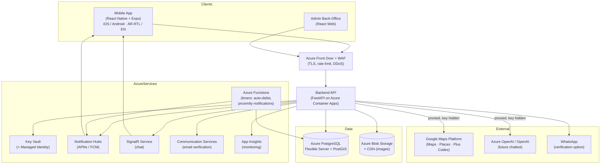
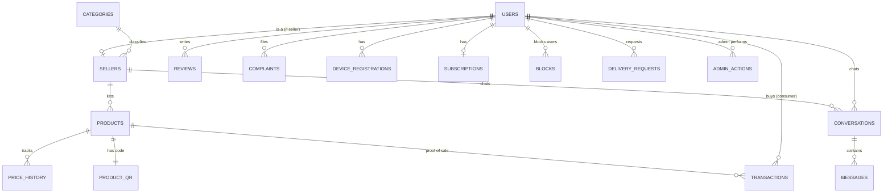

# PROJECT_MAP.md — Canonical Project Structure & File Guide

> **Purpose:** This is the living map of the entire codebase. It exists so that you (and any future agent or developer) can quickly find where anything lives, understand what each file does, and know exactly where to add new features or make changes safely.
> **Rule:** Whenever a file or folder is **added, moved, or renamed**, update this document **in the same change set**. This file must never fall out of sync with the repo.
> Companion document: **`BUILD_PROMPT.md`** (the full product/technical specification and phased build plan).

---

## 1. SYSTEM ARCHITECTURE (high level)



**Key architectural rules**
- The mobile app **never** talks to Google Maps or OpenAI directly — every third-party call is **proxied through the backend** so API keys stay server-side.
- Secrets live only in **Key Vault**, reached via **Managed Identity**.
- **No payment component exists anywhere** in this architecture by design.

---

## 2. DATA MODEL (ERD)



### Table catalogue (see `backend/app/models/` and `docs/DATA_MODEL.md`)
| Table | Purpose / key fields |
|---|---|
| `users` | Identity for all roles. `role` (consumer/seller/admin), `email`, **`phone` (mandatory)**, `whatsapp`, `verification_method` (email/whatsapp), `verification_status`, `device_id`, `ip_last` (weak signal), `reputation_score`, `created_at`. |
| `sellers` | Seller profile (1:1 with a seller `user`). `type` (shop/factory), `category_id`, `shop_name`, `shop_photo_url`, `personal_photo_url`, **`geo_point` (PostGIS)**, `plus_code`, `location_description`, `exterior_photos[]`. |
| `categories` | Taxonomy. `name_ar`, `name_en`, `active`. |
| `products` | Listings. `type` (regular/market_discount/near_expiry), `title`, `description`, `images[]`, **`original_price`**, **`discounted_price`**, `currency`, **`expiry_date`**, **`expiry_class`** (best_before/use_by), **`quantity`**, `status` (active/sold_out/expired/hidden), timestamps. |
| `price_history` | Immutable log of price changes for fraud review. `product_id`, prices, `changed_at`, `changed_by`. |
| `product_qr` | Per-product code for QR resolution. `product_id`, `code`, `created_at`. Not exposed in public listing payloads. |
| `transactions` | **Proof-of-sale records.** `product_id`, `seller_id`, `consumer_id`, `quantity`, `status` (pending/confirmed/expired), `scanned_at`, `confirmed_at`. Pending expires after ~10 min. |
| `reviews` | Bi-directional ratings. `author_id`, `target_id`, `target_type`, `rating`, `text`, `status`. |
| `complaints` | Report queue (no auto-ban). `reporter_id`, `target_id`, `target_type`, `listing_id?`, `reason`, `status`, `reviewed_by`, `admin_notes`. |
| `conversations` / `messages` | Chat. Messages are **sanitized**; support report/block. |
| `blocks` | User blocking for chat/abuse. |
| `delivery_requests` | Optional delivery. `consumer_id`, `seller_id`, `product_id?`, `geo_point`, `location_description`, `status`. **No payment fields.** |
| `device_registrations` | Push tokens for Notification Hubs. `platform` (apns/fcm), `token`. |
| `subscriptions` | Tier model only (consumer/shop/factory). `tier`, `active`. **No collection/payment.** |
| `admin_actions` | Audit of manual moderation actions. |

---

## 3. REPOSITORY TREE — WHAT EVERY FILE/FOLDER DOES

```
localmarket/
│
├── README.md                     # Project intro, quickstart, links to BUILD_PROMPT.md & this map
├── PROJECT_MAP.md                # ← THIS FILE. Canonical structure map (keep updated)
│
├── .github/
│   └── workflows/
│       ├── ci.yml                # Lint + type-check + test on every PR
│       ├── deploy-backend.yml    # Build container, push, deploy to Container Apps
│       ├── deploy-mobile.yml     # Expo build/submit pipeline
│       └── deploy-infra.yml      # Provision/update infra (Bicep/Terraform)
│
├── docs/
│   ├── ARCHITECTURE.md           # System diagram + component responsibilities
│   ├── DATA_MODEL.md             # Full ERD + every table's columns, types, indexes
│   ├── SECURITY.md               # Security controls, OWASP mapping, checklist
│   ├── API.md                    # Endpoint catalogue (kept in sync with OpenAPI)
│   ├── PREFLIGHT.md              # Go/no-go: Azure-in-Syria availability; email/WhatsApp deliverability
│   └── BACKLOG.md                # Deferred ideas (scope-drift parking lot)
│
├── infra/                        # Infrastructure as Code (Bicep or Terraform)
│   ├── main.bicep                # Root composition of all Azure resources
│   ├── modules/
│   │   ├── container-app.bicep   # Backend hosting
│   │   ├── postgres.bicep        # PostgreSQL Flexible Server + PostGIS
│   │   ├── storage-cdn.bicep     # Blob + CDN for images
│   │   ├── keyvault.bicep        # Key Vault + Managed Identity roles
│   │   ├── notification-hubs.bicep
│   │   ├── signalr.bicep
│   │   ├── communication.bicep   # Email (Azure Communication Services)
│   │   ├── functions.bicep       # Timer functions
│   │   ├── frontdoor-waf.bicep   # Edge, WAF, TLS (may be enabled at scale)
│   │   └── monitoring.bicep      # App Insights
│   └── parameters/               # dev.json / staging.json / prod.json
│
├── backend/                      # FastAPI application (Python 3.12+)
│   ├── Dockerfile                # Container build
│   ├── pyproject.toml            # Deps, ruff/black/mypy config
│   ├── .env.example              # Required env vars (no real secrets)
│   ├── alembic/                  # DB migrations (one revision per schema change)
│   ├── tests/                    # Mirrors app/ — unit + integration tests
│   └── app/
│       ├── main.py               # App entrypoint: middleware, router registration, startup
│       ├── core/
│       │   ├── config.py         # Settings from env/Key Vault (nothing hardcoded)
│       │   ├── security.py       # Auth guards, OBJECT-LEVEL AUTHZ helper (BOLA prevention)
│       │   ├── rate_limit.py     # Global + per-endpoint rate limiting
│       │   ├── errors.py         # Structured, non-enumerable error responses
│       │   └── logging.py        # App Insights logging (never logs secrets/PII)
│       ├── db/
│       │   ├── session.py        # Engine/session; Managed Identity connection
│       │   └── postgis.py        # PostGIS helpers (geospatial queries)
│       ├── models/               # SQLAlchemy ORM — one file per domain
│       │   ├── user.py           # users
│       │   ├── seller.py         # sellers, categories
│       │   ├── product.py        # products, price_history, product_qr
│       │   ├── transaction.py    # transactions (proof of sale)
│       │   ├── review.py         # reviews
│       │   ├── complaint.py      # complaints, admin_actions
│       │   ├── chat.py           # conversations, messages, blocks
│       │   ├── delivery.py       # delivery_requests
│       │   ├── device.py         # device_registrations
│       │   └── subscription.py   # subscriptions (tiers only)
│       ├── schemas/              # Pydantic v2 request/response models (mirror models/)
│       ├── api/                  # Routers grouped by domain
│       │   ├── auth.py           # signup/login, email/WhatsApp verify, phone required
│       │   ├── sellers.py        # seller onboarding/profile/location
│       │   ├── categories.py     # taxonomy
│       │   ├── listings.py       # product CRUD (3 types), expiry rules, manual stock
│       │   ├── qr.py             # QR display data + scan/confirm endpoints
│       │   ├── search.py         # geospatial + filtered unified feed
│       │   ├── reviews.py        # bi-directional reviews
│       │   ├── complaints.py     # report queue (no auto-ban)
│       │   ├── chat.py           # SignalR negotiate + message endpoints
│       │   ├── delivery.py       # delivery requests (no payment)
│       │   ├── notifications.py  # device registration
│       │   ├── maps.py           # Google Maps PROXY (key hidden)
│       │   ├── billing.py        # subscription tiers/entitlements (no collection)
│       │   └── ai.py             # future chatbot PROXY (Azure OpenAI/OpenAI)
│       ├── services/             # Business logic (kept out of routers)
│       │   ├── auth_service.py
│       │   ├── seller_service.py
│       │   ├── listing_service.py     # expiry validation (use_by rejection), pricing, delist
│       │   ├── qr_service.py          # code gen, scan→confirm→decrement, 10-min timeout
│       │   ├── search_service.py      # "near me" + filters
│       │   ├── review_service.py
│       │   ├── moderation_service.py  # complaints, reputation (manual)
│       │   ├── chat_service.py
│       │   ├── delivery_service.py
│       │   └── notification_service.py
│       ├── auth/                 # Verification providers (email via ACS/SendGrid, WhatsApp)
│       ├── qr/                   # QR encode/decode utilities
│       ├── media/                # Upload pipeline: type-validate, EXIF-strip, scan, resize, Blob
│       ├── notifications/        # Notification Hubs client
│       ├── search/               # Query builders / indexes
│       ├── moderation/           # Complaint/reputation logic
│       ├── billing/              # Tier definitions + feature gating
│       └── ai/                   # Model-swappable chatbot proxy interface (stub now)
│
├── mobile/                       # React Native + Expo (TypeScript)
│   ├── app.config.ts             # Expo config (no third-party API keys)
│   ├── package.json
│   ├── app/                      # expo-router screens (file-based routing)
│   │   ├── (auth)/               # signup, verify, login
│   │   ├── (consumer)/           # map home, feed, listing detail, scanner, chat, delivery
│   │   └── (seller)/             # onboarding, listings, QR display, scan-confirm, stock
│   └── src/
│       ├── i18n/
│       │   ├── ar/               # Arabic strings
│       │   ├── en/               # English strings
│       │   └── rtl.ts            # RTL configuration & helpers
│       ├── api/                  # Typed client to the backend (all data via backend only)
│       ├── components/           # Reusable, RTL-aware UI components
│       ├── features/
│       │   ├── seller/           # seller screens/logic
│       │   ├── consumer/         # consumer screens/logic
│       │   ├── listings/         # listing cards, countdown timer, price display
│       │   ├── map/              # map view, nearby sellers, pin picker, directions
│       │   ├── qr/               # QR display (seller) + scanner (consumer)
│       │   ├── chat/             # conversation UI
│       │   ├── reviews/          # rating UI
│       │   └── delivery/         # delivery request UI
│       ├── store/                # State management
│       ├── hooks/                # Shared hooks (auth, location, offline cache)
│       └── theme/                # Tokens + RTL-aware styling
│
├── admin-web/                    # Back-office (React web, TypeScript)
│   └── src/
│       ├── pages/                # complaints queue, categories, analytics, users
│       ├── components/
│       └── api/                  # Admin API client
│
└── functions/                    # Azure Functions (timers)
    ├── auto_delist/              # Hide items past expiry / quantity == 0
    │   └── __init__.py
    └── proximity_notifications/  # "Deal near you" pushes to nearby consumers
        └── __init__.py
```

---

## 4. HOW TO EXTEND THE PROJECT (common changes)

**Add a new database table / field**
1. Add/modify the model in `backend/app/models/<domain>.py`.
2. Generate an Alembic migration in `backend/alembic/`.
3. Add/adjust Pydantic schemas in `backend/app/schemas/`.
4. Update `docs/DATA_MODEL.md` and the table catalogue in Section 2 here.

**Add a new API endpoint**
1. Add the route in `backend/app/api/<domain>.py`; keep logic in `backend/app/services/`.
2. Enforce **object-level authorization** (`core/security.py`) and validation.
3. Update `docs/API.md`.

**Add a new mobile screen/feature**
1. Create the screen under `mobile/app/(consumer|seller)/` and logic under `mobile/src/features/<feature>/`.
2. Add strings to `src/i18n/ar` and `src/i18n/en`; verify RTL.
3. Call the backend only via `mobile/src/api/` (never a third-party key directly).

**Add a background job**
1. New folder under `functions/`; wire the timer in `infra/modules/functions.bicep`.

**Add the AI chatbot (future)**
1. Implement the provider behind the interface in `backend/app/ai/` and the proxy route in `api/ai.py`.
2. Keep the model **swappable** (start with ChatGPT/OpenAI); key stays server-side.

Whenever you add a file, **add a line for it in Section 3 of this document.**

---

## 5. ENVIRONMENT & CONFIG MAP

- **Secrets:** Azure **Key Vault** only; accessed via **Managed Identity**. Never in git, `.env`, or client bundles.
- **`.env.example`** lists required variable **names** (DB, Blob, Notification Hubs, SignalR, ACS, Google Maps key, OpenAI key, etc.) with **no real values**.
- **Per-environment infra parameters:** `infra/parameters/{dev,staging,prod}.json`.
- **Feature flags:** subscription/billing gating and per-role pricing live in config (consumer price defaults to free per the advisory in `BUILD_PROMPT.md` §4).

---

## 6. GO/NO-GO PRE-FLIGHT (before production) — see `docs/PREFLIGHT.md`
1. **Azure commercial availability for serving Syria** — confirmed by human owner.
2. **Email / WhatsApp verification deliverability to Syrian users** — tested and confirmed (SMS is intentionally not used).

---

*Keep this file current. It is the primary map for anyone editing or expanding the project.*
