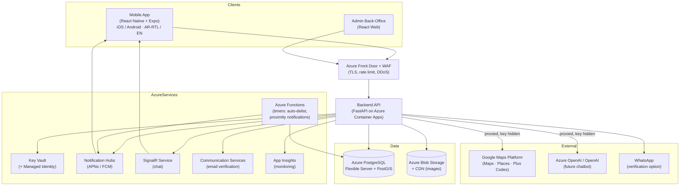

# ARCHITECTURE.md — System Architecture

## Overview

LocalMarket is a cross-platform mobile marketplace for Syria that connects local shops and factories with consumers through discovery and connection. The platform is a **DISCOVERY + CONNECTION platform only** — no in-app payments.

## System Components

## Key Architectural Rules

1. **No Payment Component:** The platform has no in-app payment, wallet, card processing, or money movement of any kind
2. **Server-Side Keys:** The mobile app never talks to Google Maps or OpenAI directly — every third-party call is proxied through the backend
3. **Secrets Management:** All secrets live only in Azure Key Vault, accessed via Managed Identity
4. **Multi-Tenant Isolation:** A seller must never access another seller's data
5. **RTL-First:** Full Arabic (RTL) + English (LTR), user-switchable, correct RTL layout

## Data Flow

### Authentication Flow
1. User registers with email/WhatsApp + mandatory phone
2. Verification code sent via ACS (email) or WhatsApp
3. User verifies → JWT token issued
4. Token used for all authenticated requests

### Product Listing Flow
1. Seller creates product (3 types: regular/market_discount/near_expiry)
2. Product images uploaded → EXIF stripped → stored in Blob
3. QR code generated for the product
4. Product appears in search results based on location/filters

### QR Proof-of-Sale Flow
1. Consumer scans seller's product QR (physically present)
2. Pending scan record created
3. Seller receives notification
4. Seller confirms + enters quantity
5. Transaction/proof record created
6. Inventory decremented

### Chat Flow
1. Consumer initiates chat with seller
2. Messages sent via SignalR
3. Messages sanitized (anti-XSS)
4. Rate limiting prevents spam

## Security Architecture

- **OWASP Mobile Top 10** and **OWASP API Security Top 10** compliance
- **Object-level authorization** on every endpoint
- **Rate limiting** on all endpoints
- **Certificate pinning** in mobile app
- **Root/jailbreak detection** in mobile app

## Scalability

- **Scale-to-zero:** Container Apps can scale to 0 replicas
- **CDN:** Images served via CDN for performance
- **PostGIS:** Geospatial queries optimized with spatial indexes
- **Caching:** Listings cached locally for offline resilience

---

*See BUILD_PROMPT.md for complete technical specification.*
