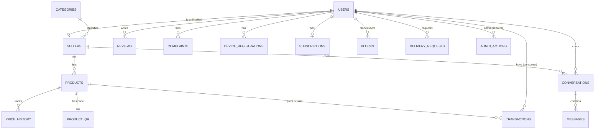

# DATA_MODEL.md — Entity Relationship Diagram

## ERD

## Table Catalogue

### users
Identity for all roles.

| Column | Type | Constraints | Description |
|--------|------|-------------|-------------|
| id | UUID | PK | Primary key |
| email | VARCHAR(255) | UNIQUE, NULLABLE | Email address |
| phone | VARCHAR(20) | NOT NULL | Phone number (mandatory) |
| whatsapp | VARCHAR(20) | NULLABLE | WhatsApp number |
| password_hash | VARCHAR(255) | NOT NULL | Hashed password |
| role | ENUM | NOT NULL | consumer/seller/admin |
| verification_method | ENUM | NOT NULL | email/whatsapp |
| verification_status | ENUM | NOT NULL | pending/verified/failed |
| device_id | VARCHAR(255) | NULLABLE | Device fingerprint |
| ip_last | INET | NULLABLE | Last IP (weak signal) |
| reputation_score | DECIMAL(3,2) | DEFAULT 1.00 | Trust score |
| created_at | TIMESTAMP | NOT NULL | Creation timestamp |
| updated_at | TIMESTAMP | NOT NULL | Last update timestamp |

### sellers
Seller profile (1:1 with a seller user).

| Column | Type | Constraints | Description |
|--------|------|-------------|-------------|
| id | UUID | PK | Primary key |
| user_id | UUID | FK, UNIQUE | References users |
| type | ENUM | NOT NULL | shop/factory |
| category_id | UUID | FK | References categories |
| shop_name | VARCHAR(100) | NOT NULL | Business name |
| shop_photo_url | VARCHAR(500) | NULLABLE | Shop image |
| personal_photo_url | VARCHAR(500) | NULLABLE | Owner photo |
| geo_point | GEOMETRY(POINT, 4326) | NOT NULL | PostGIS location |
| plus_code | VARCHAR(20) | NULLABLE | Google Plus Code |
| location_description | TEXT | NULLABLE | Free-text location |
| exterior_photos | JSONB | DEFAULT '[]' | Array of photo URLs |
| created_at | TIMESTAMP | NOT NULL | Creation timestamp |
| updated_at | TIMESTAMP | NOT NULL | Last update timestamp |

### categories
Taxonomy for shops and products.

| Column | Type | Constraints | Description |
|--------|------|-------------|-------------|
| id | UUID | PK | Primary key |
| name_ar | VARCHAR(100) | NOT NULL | Arabic name |
| name_en | VARCHAR(100) | NOT NULL | English name |
| slug | VARCHAR(100) | UNIQUE | URL-friendly slug |
| active | BOOLEAN | DEFAULT true | Is category active |
| created_at | TIMESTAMP | NOT NULL | Creation timestamp |

### products
Product listings.

| Column | Type | Constraints | Description |
|--------|------|-------------|-------------|
| id | UUID | PK | Primary key |
| seller_id | UUID | FK | References sellers |
| type | ENUM | NOT NULL | regular/market_discount/near_expiry |
| title | VARCHAR(200) | NOT NULL | Product title |
| description | TEXT | NULLABLE | Product description |
| images | JSONB | DEFAULT '[]' | Array of image URLs |
| original_price | DECIMAL(10,2) | NOT NULL | Original price |
| discounted_price | DECIMAL(10,2) | NOT NULL | Discounted price |
| currency | VARCHAR(3) | DEFAULT 'SYP' | Currency code |
| expiry_date | DATE | NULLABLE | Expiry date |
| expiry_class | ENUM | NULLABLE | best_before/use_by |
| quantity | INTEGER | NOT NULL | Available quantity |
| status | ENUM | NOT NULL | active/sold_out/expired/hidden |
| created_at | TIMESTAMP | NOT NULL | Creation timestamp |
| updated_at | TIMESTAMP | NOT NULL | Last update timestamp |

### price_history
Immutable log of price changes for fraud review.

| Column | Type | Constraints | Description |
|--------|------|-------------|-------------|
| id | UUID | PK | Primary key |
| product_id | UUID | FK | References products |
| original_price | DECIMAL(10,2) | NOT NULL | Original price at time |
| discounted_price | DECIMAL(10,2) | NOT NULL | Discounted price at time |
| changed_at | TIMESTAMP | NOT NULL | When price changed |
| changed_by | UUID | FK | Who changed it |

### product_qr
Per-product code for QR resolution.

| Column | Type | Constraints | Description |
|--------|------|-------------|-------------|
| id | UUID | PK | Primary key |
| product_id | UUID | FK, UNIQUE | References products |
| code | VARCHAR(100) | UNIQUE | QR code value |
| created_at | TIMESTAMP | NOT NULL | Creation timestamp |

### transactions
Proof-of-sale records.

| Column | Type | Constraints | Description |
|--------|------|-------------|-------------|
| id | UUID | PK | Primary key |
| product_id | UUID | FK | References products |
| seller_id | UUID | FK | References sellers |
| consumer_id | UUID | FK | References users |
| quantity | INTEGER | NOT NULL | Quantity sold |
| status | ENUM | NOT NULL | pending/confirmed/expired |
| scanned_at | TIMESTAMP | NOT NULL | When QR was scanned |
| confirmed_at | TIMESTAMP | NULLABLE | When seller confirmed |

### reviews
Bi-directional ratings (consumer↔seller).

| Column | Type | Constraints | Description |
|--------|------|-------------|-------------|
| id | UUID | PK | Primary key |
| author_id | UUID | FK | References users |
| target_id | UUID | FK | References users |
| target_type | ENUM | NOT NULL | seller/consumer |
| rating | INTEGER | NOT NULL | 1-5 stars |
| text | TEXT | NULLABLE | Review text |
| status | ENUM | NOT NULL | active/hidden/reported |
| created_at | TIMESTAMP | NOT NULL | Creation timestamp |

### complaints
Report queue (no auto-ban).

| Column | Type | Constraints | Description |
|--------|------|-------------|-------------|
| id | UUID | PK | Primary key |
| reporter_id | UUID | FK | References users |
| target_id | UUID | FK | References users |
| target_type | ENUM | NOT NULL | seller/listing/review |
| listing_id | UUID | FK, NULLABLE | References products |
| reason | TEXT | NOT NULL | Complaint reason |
| status | ENUM | NOT NULL | pending/reviewed/resolved |
| reviewed_by | UUID | FK, NULLABLE | Admin who reviewed |
| admin_notes | TEXT | NULLABLE | Admin notes |
| created_at | TIMESTAMP | NOT NULL | Creation timestamp |

### conversations / messages
Chat system.

| Column | Type | Constraints | Description |
|--------|------|-------------|-------------|
| id | UUID | PK | Primary key |
| participant1_id | UUID | FK | References users |
| participant2_id | UUID | FK | References users |
| created_at | TIMESTAMP | NOT NULL | Creation timestamp |

| Column | Type | Constraints | Description |
|--------|------|-------------|-------------|
| id | UUID | PK | Primary key |
| conversation_id | UUID | FK | References conversations |
| sender_id | UUID | FK | References users |
| content | TEXT | NOT NULL | Sanitized message |
| created_at | TIMESTAMP | NOT NULL | Creation timestamp |

### blocks
User blocking for chat/abuse.

| Column | Type | Constraints | Description |
|--------|------|-------------|-------------|
| id | UUID | PK | Primary key |
| blocker_id | UUID | FK | References users |
| blocked_id | UUID | FK | References users |
| created_at | TIMESTAMP | NOT NULL | Creation timestamp |

### delivery_requests
Optional delivery (no payment).

| Column | Type | Constraints | Description |
|--------|------|-------------|-------------|
| id | UUID | PK | Primary key |
| consumer_id | UUID | FK | References users |
| seller_id | UUID | FK | References sellers |
| product_id | UUID | FK, NULLABLE | References products |
| geo_point | GEOMETRY(POINT, 4326) | NOT NULL | Delivery location |
| location_description | TEXT | NULLABLE | Free-text description |
| status | ENUM | NOT NULL | pending/accepted/completed/cancelled |
| created_at | TIMESTAMP | NOT NULL | Creation timestamp |

### device_registrations
Push tokens for Notification Hubs.

| Column | Type | Constraints | Description |
|--------|------|-------------|-------------|
| id | UUID | PK | Primary key |
| user_id | UUID | FK | References users |
| platform | ENUM | NOT NULL | apns/fcm |
| token | VARCHAR(500) | NOT NULL | Push token |
| created_at | TIMESTAMP | NOT NULL | Creation timestamp |

### subscriptions
Tier model only (no payment collection).

| Column | Type | Constraints | Description |
|--------|------|-------------|-------------|
| id | UUID | PK | Primary key |
| user_id | UUID | FK | References users |
| tier | ENUM | NOT NULL | consumer/shop/factory |
| active | BOOLEAN | DEFAULT true | Is subscription active |
| created_at | TIMESTAMP | NOT NULL | Creation timestamp |

### admin_actions
Audit of manual moderation actions.

| Column | Type | Constraints | Description |
|--------|------|-------------|-------------|
| id | UUID | PK | Primary key |
| admin_id | UUID | FK | References users |
| action_type | ENUM | NOT NULL | suspend/adjust_reputation/resolve_complaint |
| target_id | UUID | NOT NULL | Target entity ID |
| target_type | ENUM | NOT NULL | user/listing/complaint |
| notes | TEXT | NULLABLE | Admin notes |
| created_at | TIMESTAMP | NOT NULL | Creation timestamp |

---

## Indexes

### Spatial Indexes
- `sellers.geo_point` — GiST index for "near me" queries

### Performance Indexes
- `users.email` — Unique index for login
- `users.phone` — Index for phone lookup
- `products.seller_id` — Index for seller's listings
- `products.status` — Index for active listings
- `products.expiry_date` — Index for expiry queries
- `products.type` — Index for type filtering
- `transactions.product_id` — Index for product transactions
- `transactions.seller_id` — Index for seller transactions
- `conversations.participant1_id, participant2_id` — Composite index

---

*See backend/app/models/ for SQLAlchemy ORM definitions.*
